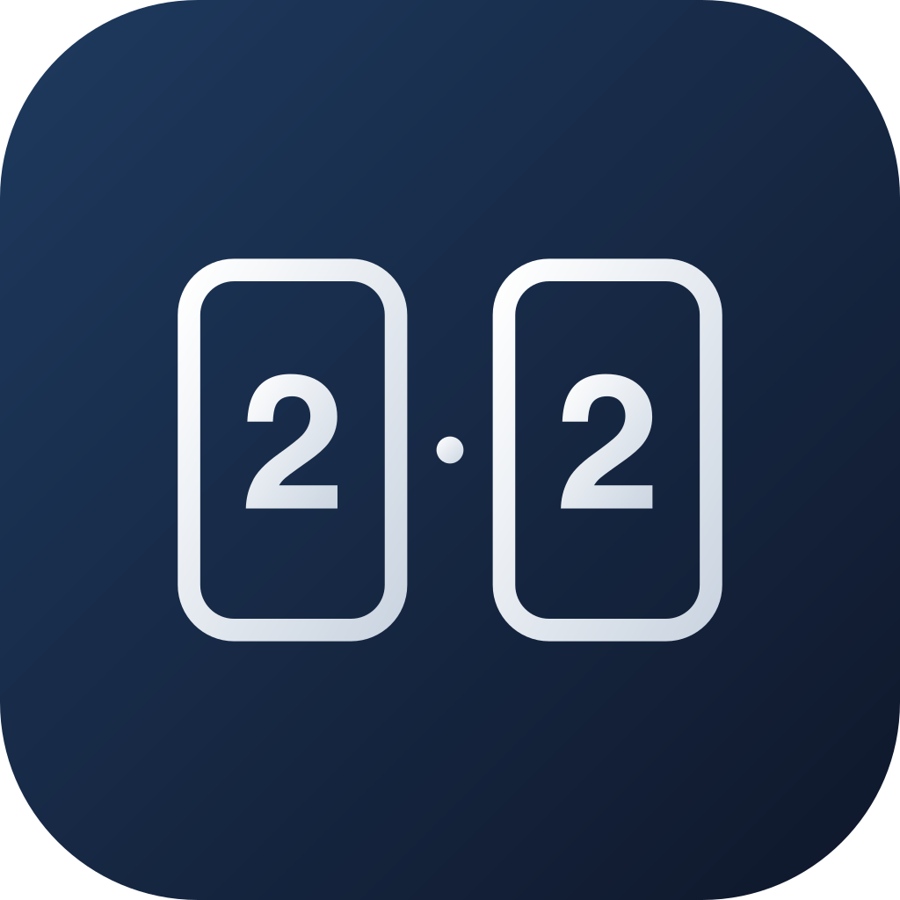

<div align="center">



# 记分板

**通用双队对战计分 App · 篮球 / 乒乓球 / 羽毛球 / 任何两方轮流得分的场景**

[📥 下载 APK](https://github.com/xiaoxijin199307081491-a11y/ScoreboardApp/releases/latest) · [快速开始](#快速开始) · [构建 APK](#构建-apk)


</div>

---

## 为什么会做这个

以前打球打到一半想记分，要么打开备忘录手敲「15 - 12」，要么下一个专门的计分 App——前者队友拍个肩就把屏幕清了，后者满屏广告加「请开通会员」。

于是自己写了一个。**一个屏幕，一千多行 JS，没广告没会员没账号**。点一下加分，点一下减分，瞄一眼时间，听见比分被念出来，打完一局存到历史，**一张分享图发到群里**。就这些。

---

## 它能做什么

### 🎯 计分 & 计时
- 主队 / 客队独立加分、减分（-1 按钮在屏幕底部，背景图盖不到）
- 比赛计时器，自定义时长（自研滚轮选择器，零依赖）
- 比赛结束自动写入本地战绩

### 🔊 反馈
- 全交互点 5 档震动反馈（`expo-haptics`）
- 比分中文语音播报「二比一」——用设备自带离线 TTS（`expo-speech`），不联网
- 每队可独立设置加分音效：**麦克风现录** 或 **从手机里挑**（`expo-audio` + `expo-document-picker`）

### 🏆 战绩 & 分享
- 历史战绩自动留存：队名、最终比分、胜方、时长
- 一键生成分享图：截屏 → 系统分享面板（`react-native-view-shot` + `expo-sharing`）

### 🎨 个性化
- 每队可单独设置背景图（相册选图）
- Glassmorphism 玻璃拟态 UI（Apple HIG Materials 4 维度）
- 横竖屏自适应

### 📴 离线优先
- 没网也能用
- 无账号、无广告、无埋点、无后台

---

## 快速开始

开发模式跑起来只要 3 条命令：

```bash
git clone https://github.com/xiaoxijin199307081491-a11y/ScoreboardApp.git
cd ScoreboardApp
npm install
npx expo start
```

用 Expo Go 扫码就能在手机上跑（Android / iOS 都行）。源码就一个 `App.js`，改完即热重载。

---

## 构建 APK

需要 JDK 17 和 Android SDK：

```bash
export JAVA_HOME="$(/usr/libexec/java_home -v 17)"
export ANDROID_HOME=~/Library/Android/sdk

# 首次或改了原生配置时执行
npx expo prebuild --platform android

cd android && ./gradlew assembleRelease
# 产物：android/app/build/outputs/apk/release/app-release.apk
```

最新 release 已经把 APK 挂在 [Releases 页面](https://github.com/xiaoxijin199307081491-a11y/ScoreboardApp/releases/latest)，下完直接装。

> ⚠️ **不会**清掉你手动改过的 `android/` 配置（启动屏去白底、screenOrientation）。`prebuild` 跑完会保留这些。

---

## iOS

需要 macOS + Xcode + CocoaPods：

```bash
npx expo prebuild --platform ios
npx expo run:ios
```

> 装到真机 iPhone 需要 Apple 开发者账号签名。当前没有签好的 iOS 包。

---

## 技术栈

| 类别 | 选型 |
|---|---|
| 框架 | Expo SDK 56 · React Native 0.85 · React 19 |
| 音频 | `expo-speech`（TTS）· `expo-audio`（录音/播放）· `expo-document-picker` |
| 视觉 | `expo-blur`（毛玻璃）· `expo-linear-gradient`（渐变）· `expo-image-picker` |
| 系统 | `expo-haptics`（震动）· `expo-file-system` v56（class API）· `expo-sharing` |
| 存储 | `@react-native-async-storage/async-storage` |
| 截图 | `react-native-view-shot` |
| 云构建 | EAS Build（配置在 `eas.json`） |

**无状态管理库，无导航库，无 CSS-in-JS，无 Tailwind。** 只有 `useState` 和一个超长 `StyleSheet`。整个 App 装在一个 1700 行的 `App.js` 里——一个屏幕嘛，分文件没意义。

---

## 项目结构

```
ScoreboardApp/
├── App.js              # 整个 App — 计分、计时、历史、分享、主题、弹窗
├── app.json            # Expo 配置（包名、图标、权限文案）
├── eas.json            # EAS 云构建 profile
├── package.json
├── assets/
│   ├── icon.png        # App 图标（记分牌 2:2 风格）
│   ├── gemini-svg.svg  # 图标源文件
│   └── sounds/         # 内置备用音效
├── android/            # prebuild 生成的 Android 原生工程
├── ios/                # prebuild 生成的 iOS 原生工程
├── CLAUDE.md           # 写给 AI 的项目笔记
├── LAYOUT.md           # 布局坐标参考
└── LICENSE             # MIT
```

---

## 权限说明

| 权限 | 用途 |
|---|---|
| `VIBRATE` | 触觉反馈 |
| `RECORD_AUDIO` | 录制自定义加分音效 |
| `READ_MEDIA_IMAGES` | 选择队伍背景图 |

---

## 许可

MIT — 详见 [LICENSE](LICENSE)。

---

## 致谢

- [Expo](https://expo.dev) — 让 RN 原生项目从「配置地狱」变成 `npx expo start`
- 5 个内置音效来自 [Pixabay](https://pixabay.com) 公共素材
- 应用图标设计灵感来自「单一焦点 + 大量留白」的极简风格
